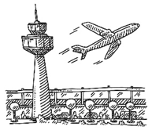

# Exercicis - Diagrames ER/ERE II

## HOTELS "Low Cost"

La cadena d'hotels «Low Cost» ens demanen que proposem un disseny d'una base de dades utilitzant el model E/R que permeti:

* Els hotels estan repartits en diferents ciutats de diferents països arreu del món. Per exemple, la cadena té 2 hotels a París i 5 a Berlín.
* Ens cal guardar el nom i el nº d'habitans de cada ciutat. En canvi dels països només en volem saber el nom.
* De cada hotel en volem saber el nom, l'adreça, el número total d'habitacions, la ciutat i el país a on es troba.
* Cada habitació dins de l'hotel s'identifica amb un número d'habitació de 3 xifres.
* Les habitacions poden ser de 3 tipus diferents: individual, doble o familiar.
* Les tarifes de les habitacions venen marcades pel tipus d'habitació i hotel a on es troben. Per exemple, no és el mateix el preu d'una habitació individual a l'hotel de París situat al centre que a l'hotel de París situat a les afores. Ara bé, una habitació de tipus individual té el mateix preu per totes les habitacions del mateix hotel independentment del pis a on estigui.
* Els clients poden realitzar reserves de les habitacions dels diferents hotels indicant la data d'entrada, la data de sortida i el número de nits que que volen realitzar l'estança.
* Dels clients ens interessa saber, el nom, cognoms, adreça, telèfon, correu electrònic i NIF. Un client pot realitzar més d'una reserva.
* Un client pot realitzar més d'una reserva dins el mateix període en habitacions del mateix hotel o d'hotels diferents.
* Dels clients també ens interessa saber per quin mitjà ens ha conegut (buscadors, premsa, agències de viatges,...). El mitjà pel qual ens ha conegut és únic per cada client.

**El nostre sistema cal que permeti. Entre altres coses, fer consultes del tipus:**

* Llistat d'hotels per ciutat
* Llistat d'hotels per país.
* Quines habitacions ha reservat un client determinat.
* Quines habitacions estan ocupades o lliures dins d'un període de temps.

## ELECCIONS GENERALS

Davant les properes eleccions al Congrés dels Diputats, se'ns demana que prepareu el disseny d'una base de dades utilitzant el model E/R vist a classe que permeti:

* A les eleccions s'hi presenten una sèrie de partits PP(Partit Pessimista), PSOE (Partit Salat i Organitzat d'Espanya), IU (Independents Units), PODEMOS (Parit Oficial Demòcrata Espanyol Municipalista Obrer Social) entre altres. A on ens interessa saber el nom llarg i les sigles del partit (aquestes seran úniques per cada partit).
* Els escons del Congrés venen determinats per les circumscripcions. Cada circumscripció té assignat un nombre determinat d'escons en el Congrés.
* Cada circumscripció s'identifica de manera única amb un nom i aquesta correspon només amb una província de l'estat que s'identifica amb un codi i a més a més ens interessa guardar el seu nom, el nom de la capital, a quina comunitat autònoma pertany i la superfície de m2.
* Per cada circumscripció es poden presentar un número determinat de llistes de partits polítics (poden haver-hi partits que no es presentin en una determinada circumscripció) i aquestes només es poden presentar en una sola circumscripció.
* Aquestes llistes de partits polítics estan formades per candidats dels quals ens interessa saber el seu dni, nom, nº de vegades que s'ha presentat, quin nº ocupa a la llista.
* Evidentment un candidat només serà d'un partit i ens interessa saber quin és el candidat de cada partit que es presenta per President del Govern.
* Cada província té un conjunt de ciutadans que voten en els municipis on estan empadronats, els quals es té la informació de el seu dni, nom, cognoms, telèfon, adreça.
* Cada municipi s'identifica amb un codi únic i a més amés ens interessa saber el seu nom, el nom complet (nom i cognoms de l'actual alcalde).
* A cada municipi es disposen les meses electorals corresponents per què els ciutadans votin. Normalment es situen en col·legis electorals. A cada ciutadà li correspondrà anar a votar a una determinada mesa electoral i vota a una sola llista (no vota a un candidat, sinó a una llista de la seva circumscripció).
* Les meses electorals s'identifiquen pel municipi a on són i dins el municipi per districte (valor numèric de dos dígits), secció (valor numèric 3 dígits) i mesa(caràcter representat per una lletra). La conjunció dels valors de districte, secció i mesa poden ser iguals en diferents municipis, però no dins el mateix municipi.
* El nostre sistema ha de permetre que el dia de les eleccions i després del recompte de vots, cada mesa pugui entrar el número de vots que han obtingut de les llistes dels partits que s'hi presentaven.

**El nostre sistema cal que permeti. Entre altres coses, fer consultes del tipus:**

* Nº d'habitants empadronats en un municipi.
* Votants d'un municipi i quina mesa tenen assignada.
* Municipis d'una província
* Partits que es presenten en una província.
* Quin són els candidats d'un partit en una determinada província.
* Per cada partit, quin és el candidat que es presenta com a President del Govern.
* Número de vots que ha obtingut un partit en una mesa, en un municipi i en una província.

## EXERCICI JOCS OLÍMPICS

Els Jocs Olímpics són una competició esportiva a nivell mundial per uns certs esports considerats olímpics.

D’aquests esports en volem guardar el nom i el logotip que representa l’esport dins els Jocs, com per exemple els següents: Equitació, Tenis.

Els esportistes no realitzen proves d’un esport sinó de les seves disciplines. Cada esport pot tenir una sèrie de disciplines. Per exemple l’esport d’atletisme té: 100m, 200 m, 4x400 m, 20km marxa, Salt d’alçada, Salt amb perxa, etc... Aquests noms identifiquen de manera única les diferents disciplines.

De les disciplines se’n deriven les proves que realitzaran els esportistes. Aquestes proves poden ser només de dos tipus (ELIMINATÒRIA i FINAL) i també tenen un sexe associat (MASCULÍ, FEMENÍ, MIXT). Per exemple, en una disciplina hi hauran moltes eliminatòries abans d’arribar a la prova final a on es decidirà qui obté medalla. Totes les proves reben un número seqüencial dins de la seva disciplina per identificar-les entre les altres de la mateixa disciplina.

Els participants de les proves poden ser esportistes de forma individual, com per exemple 100m llisos, esgrima, les anelles,.. o bé per equips: futbol, bàsquet,...

Els esportistes i els equips poden participar en més d’una prova.
Una informació rellevant per la nostra BD és saber de quins esportistes estan formats els diferents equips dels diferents països.
Tots els esportistes i equips pertanyen a un país que és qui els representa en els Jocs. De cada país en volem saber el seu nom i el logotip de la bandera per mostrar-la als vídeomarcadors dels diferents estadis o emplaçaments a on es realitzen les proves. El nom del país l’identifica envers els altres.

Per tal d’identificar un esportista en tot el recinte dels jocs se’ls hi entrega una acreditació a on conté el nom i cognoms de l’esportista, el sexe i el país que el representa. També s’hi afegeix un codi de barres per tal d’identificar l’esportista envers els altres i que servirà per accedir en els diferents recintes dels Jocs.

A la BD no volem guardar països que no participin en els Jocs i no tots els països tenen representants per totes les proves de les diferents disciplines.

Durant el transcurs dels Jocs els esportistes viuen a la Vila Olímpica, aquesta està formada per edificis. Els edificis s’identifiquen per un codi i ens interessa saber-ne l’adreça dins la ciutat. Els edificis estan dividits en blocs i aquests se’ls hi assigna una lletra per cada edifici per identifcar-los. Per exemple tenim el bloc 001A corresponent al bloc A de l’edifici 001 i tenim el bloc 002A corresponent al bloc A de l’edifici 002.

Dels blocs hem de saber-ne el nº d’habitacions per tal d’assignar-hi els esportistes a mesura que arriben a la Vila.

Un país estarà assignat a un sol edifici, però els esportistes poden estar assignats en diferents blocs.

No tots els edificis disposen de menjador a on els esportistes hi podran realitzar els àpats. Per tant, hem de saber quins d’ells en disposen per tal d’informar-ho en els esportistes a mesura que arribin a la Vila.

De cada esportista o equip ens hem de guardar la posició que han quedat en cadascuna de les proves per llavors realitzar l’assignació de les medalles. 1r=Or, 2n=Plata,3r=Bronze.

Cal portar un control del medaller de tots els països. Volem saber de cada país el número de cada tipus de medalla (or, plata, bronze).

Les proves es disputen en un dia i hora concrets en un emplaçament dins d’una ciutat. Per diferenciar els diferents emplaçaments se’ls hi assignarà un nom i a més a més en volem saber la l’adreça i l’aforament limitat que tenen.

Degut a que totes les proves no es poden realitzar al mateix lloc els emplaçaments poden estar en diferents ciutats del país a on es celebren els Jocs.

**El nostre sistema cal que permeti. Entre altres coses, fer consultes del tipus:**

* Quantes proves s’han realitzat en una data concreta.
* Quantes proves eliminatòries hi ha de tipus mixt.
* Llistat de noms de ciutats a on s’hi disputen proves de les diferents disciplines.
* De cada edifici en volem saber el número de blocs que el componen i el número total d’habitacions que té.

## OPERACIÓ TRIOMF!

Donat l’èxit que ha tingut en els darrers anys, s’està preparant la nova edició. El programa ens ha encarregat el disseny d’una base de dades per tal de gestionar les cançons que interpretaran en les diferents actuacions de cada setmana, les sessions que hi ha previstes, etc. Per la propera edició:

* Dins l'Acadèmia hi treballen professors que imparteixen unes determinades assignatures organitzades en diferents sessions. Dels diferents professors ens interessa saber entre altres coses el seu DNI (dni_prof), el seu nom (nom_prof) (cog1_prof) (cog2_prof) i el seu telèfon (tel_prof).
* Un únic professor imparteix totes les sessions d’una assignatura. Les assignatures les volem tenir codificades amb un codi (codi_ass) i també guardarem informació sobre el seu nom (nom_ass) i les hores totals que s’impartiran (hores).
* Totes les sessions d’una assignatura tenen un títol (títol_ses) i un número (num_ses) que identifica cada sessió dins d’una assignatura.
* A més, els professors poden ser tutors d’alguns alumnes per tal d’assessorar-los i ajudar-los amb els problemes que puguin tenir. Cada assignatura s’imparteix en una aula determinada (aula). Cada professor solament impartirà una assignatura.
* Els alumnes hauran de cursar totes les assignatures, encara que no tenen perquè assistir a totes sessions. Es vol portar un control per saber a quines sessions de cada assignatura ha assistit cada alumne. Al final de curs els professors avaluaran amb una nota (nota) a cada un dels alumnes segons el que hagin fet en la seva assignatura.
* Cada alumne l’identifiquem amb el seu nom artístic (nom_art), encara que entre altres coses també ens interessa saber el seu nom complert (nom) (cog1) (cog2).
* Al llarg del curs els alumnes faran moltes actuacions que es veuran per la televisió.
* Aquestes actuacions estaran numerades (num_act) i de cada actuació ens interessa saber entre altres coses el dia (dia_act) i l’hora (hora_act) en que es s'emetrà.
* Cada actuació és feta per un sol alumne que interpretarà diferents cançons que seran avaluades per un Jurat que els donarà una puntuació (puntuació) per cada cançó interpretada i que serà crucial per decidir si el cantant segueix la seva formació dins l’acadèmia.
* Cada cançó la identificarem amb un codi (codi_can), encara que també en guardarem el seu nom (nom_can), la durada (dur_can) i l'any en què es va fer (any_can). Una mateixa cançó podrà ser cantada per diferents alumnes en diferents actuacions.
* A l’acadèmia també hi haurà un equip mèdic que atendrà als alumnes quan ho necessitin. Aquest equip mèdic està format per un grup de metges dels quals en sabem el número de col·legiat (num_col), el seu nom complert (nom_med) (cog1_med) (cog2_med) i el seu telèfon (tel_med).
* Cal portar un control de cada visita mèdica (num_visi) que s’ha realitzat. En concret i per cada visita mèdica cal guardar entre altres coses la data (vis_data), l’hora (vis_hora), el diagnòstic (vis_diag) i els medicaments que han receptat i la dosi que n’ha de prendre de cada un d’ells (dosi).
* De cada medicament en sabem un codi (codi_medi) i el seu nom (nom_medi).
* Cada visita es feta a un alumne i per un o més metges.

**Comproveu que el vostre sistema, entre altres coses, permeti:**

* Donat un alumne saber qui és el seu tutor i les cançons que ha cantat en les diferents actuacions amb la nota que ha obtingut en cada una d’elles.
* Donada una assignatura, saber a quines sessions ha assistit cada alumne.
* Volem saber també la nota que cada alumne ha obtingut en les diferents assignatures que fa.
* Donat un alumne, hem de saber la data i el diagnòstic de totes les visites mèdiques que ha assistit, per quin o quins metges ha Estat realitzada la visita, i els medicaments i la dosi que se li han receptat

## LLIGA DE FUTBOL PROFESSINAL (LFP)

La lliga de futbol professional, presidida per Àngela María Villalobos, ha decidit informatitzar la seva competició creant una base de dades per a guardar la informació dels partits que es juguen en la lliga:

* Es desitja guardar en primer lloc les dades dels jugadors. De cada jugador es vol guardar el nom, la data de naixement i la posició en la que juga (porter, defensa, migcampista...).
* Cada jugador té un codi de jugador que l’identifica de manera única. De cadascun dels equips de la lliga és necessari enregistrar el nom de l'equip, nom de l'estadi en el que juga, l'aforament que té, l'any de fundació de l'equip i la ciutat d'on és l'equip i la ciutat on està situat l'estadi.
* Cada equip també té un codi que l’identifica de manera única. Un jugador només pot pertànyer a un únic equip. De cada partit que els equips de la lliga juguen cal guardar la data en la que es juga el partit, els gols que ha fet l'equip de casa i els gols que ha fet l'equip de fora. Cada partit tindrà un codi numèric per a identificar-lo.
* També es vol portar una estadística dels gols que hi ha en cada partit. Es vol emmagatzemar el jugador que l'ha realitzat, el minut en el que es va realitzar i una petita descripció del gol (resum de com s'ha produït gol).
* Cal tenir en compte que en un partit hi poden haver diferents gols i un jugador pot fer diversos gols en un partit.
* Finalment es vol emmagatzemar, en la base de dades, les dades dels presidents dels equips de futbol (dni, nom, cognoms, data de naixement, equip del que és president i any en el que va ser triat president).
* Un equip de futbol tan sols pot tenir un president, i una persona només pot ser president d'un equip de la lliga.
* Dels enfrontament que fan els equips, ens cal saber cada equip si juga com a local o com a visitant i en conseqüència ens interessa saber el total de gols marcats per l'equip local i la quantitat de gols total marcats per l'equip visitant.

## CADENA DE SUPERMERCATS

El propietari d’una important cadena de supermercats, ens ha encarregat dissenyar una base de dades per portar el control i la gestió dels aspectes referents al seu negoci. Així doncs, ens dóna la informació següent:

* Cadascun dels supermercats estarà perfectament identificat amb un codi. A més, cada supermercat
disposarà d’empleats. Naturalment, cada supermercat de la cadena tindrà molts empleats tot i que un d’ells només estarà en un determinat supermercat.
* Hi haurà un empleat del Supermercat que en serà el Director.
* Cada supermercat disposa de varies caixes. Dins de cada supermercat identifiquem les caixes com caixa1, caixa2, caixa3, etc.
* Els productes del supermercat estan perfectament identificats pel codi de barres i ens interessa saber el seu nom i el preu de venda. També ens interessa saber la quantitat que hi ha en cada supermercat i quina és la quantitat mínima que hi ha d’haver a cada supermercat.
* Els productes es classifiquen en categories (begudes, frescos, congelats, plats preparats, nadons, drogueria, perfumeria, alimentació,..). Un producte només pot formar par d'una sola categoria.
* Quan falta un producte, els supermercats demanen una comanda a un dels proveïdors d’aquest producte. Cada comanda estarà formada per una sèrie de productes que es demanen i en quina quantitat. Hem de quardar la data de cada comanda i aquesta sempre anirà dirigida a un únic proveïdor.
* Alguns productes i en determinades dates s’ofereixen en oferta especial. D’aquesta manera un producte el poden tenir en l’oferta 1 (estiu) en unes determinades dates a un determinat preu, en l’oferta 2 (hivern) en unes altres dates i diferent preu, etc. Ens interessa saber el preu de cada un d’aquest productes en els dies d’oferta especial ja que pot variar.
* Els clients venen al supermercat a realitzar les seves compres. Alguns dels clients els tenim identificats a través de la targeta del super, i en aquest cas sabem el seu nom complert, dni, targeta de crèdit, adreça, població, etc. D’altres compres no sabem el client que les ha fet.
* De totes les compres que realitzen els clients ens interessa saber el dia, l’hora, en quina caixa han pagat, quin empleat l’ha cobrada i el detall de la compra, o sigui quins productes, en quina quantitat i a quin preu. Aquestes compres que passen per caixa les podrem relacionar amb un client si ens mostra la seva targeta, en cas contrari no tindrem informació de qui ha fet la compra.

**Cal que el nostre sistema respongui a:**

* Donat el codi d’un producte saber la quantitat que en hi ha a cada supermercat i quina és la quantitat mínima que en hi ha d’haver.
* Per cada comanda de compra ens interessa saber el super que l’ha fet, el proveïdor a qui va dirigida i quins productes i quina quantitat es demanen.
* Donat un client dels que tenim identificat, saber les compres que ha fet, el supermercats on les ha realitzat i els productes i en quina quantitat ens ha comprat.
* Per cada compra hem de saber en quina caixa s’ha cobrat, quin empleat l’ha cobrat i el detall de la compra. Si és possible també ens interessa saber el client que l’ha fet.
* Donat un determinat producte saber en quins dies ha estat en oferta especial i a quin preu s’ha venut.
* Saber tots els empleats de cada supermercat i qui en és el seu director.
* Saber les caixes que hi ha a cada super .

## EUROLLIGA DE BÀSQUET

L'Eurolliga de bàsquet ens ha demanat que informatitzem totes les dades referents a la fase classificatòria pel TOP16, altrament anomenada FASE de GRUPS d'una sola temporada.

Aquesta fase classificatòria es regeix en 4 grups de 6 equips per grup.

* Els equips s'enfrontaran entre ells dins del mateix grup. Cada equip realitzarà 2 partits amb el mateix equip. Un es jugarà a casa i l'altre a fora.
* Cada equip està format per 15 jugadors dels quals en volem saber el seu nom, cognoms, alçada, pes.
* Els equips es distingeixen per tenir dos noms: el nom comercial i el nom del club.
* Cada equip disposa de dues equipacions, l'equipació principal i l'equipació secundària. Ens cal guardar la informació del color de les diferents equipacions dels diferents equips perquè en un mateix partit no hi pot haver dos equips amb el mateix color d'equipació.
* Un jugador pot jugar en diferents posicions (BASE, ALER, PIVOT,...), però n'hi ha una que és amb la que ell se sent més còmode.
* Per les característiques pròpies de cada jugador aquest pot substituir només a una sèrie de jugadors del seu equip.
* De cada partit en volem saber quin equip ha jugat com a local i quin com a visitant. Els partits es juguen en un dia i una hora determinats depenent dels contractes televisius.
* En el món del bàsquet es controlen molt els diferents estadístics de cada jugador en cada partit. I en volem guardar la informació. Per exemple:
  * Volem saber quants intents de 2 punts ha realitzat un cert jugador en un partit.
  * Quants punts de 2, de 1 o de 3 punts ha fet.
  * Quanitat de faltes comeses i rebudes
  * Quantitat d'assistències
  * Quantitat de rebots
  * etc....

**Amb el disseny que fem hem de poder realitzar diferents consultes com per exemple:**

* Intents de dos punts d'un jugador concret en un partit concret.
* Donat un jugador d'un equip, ens interessa saber el llistat de jugadors els qual pot subtituir.
* Quin és l'equip que ha guanyat més partits com a local
* Quin és l'equip que ha guanyat més partits com a visitant

## CÀMPING *"La Migdiada"*

El propietari d'una pineda de la Costa Brava hi vol muntar un càmping per treure'n algun rendiment. Una de les coses que té clares és que necessitarà un sistema d'informació per gestionar-lo.

Després de vàries reunions amb ell decidim que el sistema haurà de complir el següent:

* La pineda es dividirà en parcel·les a on aquestes estaran enumerades: 001, 002,003,004,...
* Les parcel·les podran ser de 3 tipus (petites, mitjanes o grans) depenent del número de m2 que tinguin:
◦ Les petites: Entre 0 i 15m2
◦ Les mitjanes: Entre 16 i 30 m2
◦ Les grans: Més de 30 m2
* A banda de saber els metres quadrats que té exactament cada parcel·la ens interessa tenir controlat si la parcel·la posseïx o no punt de llum i aigua propis i si no és el cas, saber a quants metres n'hi ha un.
* De cada parcel·la també hem de saber el número de metres que hi ha d'aquesta als serveis (lavabos / rentaplats), la piscina i al restaurant.
* Per tal de donar més informació al client volem tenir la informació de quina orientació té cada parcel·la (N=Nord, S=Sud, E=Est, O=Oest,NO=Nord-Oest,...)
* Els preus de les parcel·les vindran determinats pel seu tipus: Petites: 20€/nit, Mitjanes:40€/nit, Grans:80€/nit
* Depenent de si la parcel·la té o no aigua o llum aquesta tindrà un cost/nit extra.
* La parcel·la és llogada pels clients durant uns certs dies. D'aquests ens interessa saber quines dates té llogada la parcel·la i les seves dades personals: nom, cognoms, DNI, data de naixement, adreça, telèfon, correu electrònic.
* Per qüestions legals i de seguretat ens demanen també que portem un registre de totes les persones que hi ha a cada parcel·la. La policia pot venir un cert dia determinat i demanar-nos un llistat de tots els residents del càmping agrupats per parcel·les. D'aquests residents només hem de guardar la informació: nom, cognoms,DNI i data de naixement.
* Si les parcel·les són ocupades per caravanes o autocaravanes se'ls hi aplicarà un preu/nit a la parcel·la per qüestions de manteniments dels camins dins el càmping. De la mateixa manera que si un client vol entrar el seu cotxe perquè aquest estacioni dins la parcel·la haurà de pagar un extra al preu/nit.
* Dins de l'estança en el càmping els clients poden acumular despeses (massatges, consumicions al bar o al restaurant, lloguer pistes tenis, mini-golf,..) que seran carregades a la seva parcel·la per ser liquidades quan es realitzi el check-out/sortida. A banda del tipus de despesa ens interessa saber l'import i la data en la qual es va realitzar.
* Per qüestions de màrqueting ens interessa saber com el client ha conegut el càmping: per amics, per un anunci a la ràdio, per la TV o per un portal d'Internet.
* Pel funcionament del càmping tenim una sèrie de treballadors: recepcionistes, jardiners, cambrers, cuiners, administratius. De tots ells hem de saber-ne el nom, cognoms, dni, correu electrònic i telèfon de contacte.

## PORTAL AIRBNB

Volem crear un portal que imiti al airbnb Qui no coneix l’aplicació es tracta d’una manera que persones posin a disposició allotjament seus per llogar-los. Els allotjaments poden ser allotjament complet, una habitació privada o una habitació compartida.

Per tenir controlats els allotjaments aquest tindran un codi identificatiu. D’aquests també en volem guardar el número de persones que hi caben, l’adreça i el municipi a on està localitzat. Com que també els volem mostrar amb un Mapa ens guardarem la latitud i longitud de l’allotjament.

Els usuaris de l’aplicació són de dos tipus els amfitrions que seran les persones que podran publicar els allotjaments i els guests que seran qui podran reservar els allotjaments. Els guests i els amfitrions són persones físiques i no poden ser empreses. D’aquests ens guardarem el nom, els cognoms i l’adreça postal. Per poder accedir a l’aplicació s’utilitzarà un email i una contrasenya.

Els amfitrions quan publiquen un allotjament han de definir les tarifes d’aquest. Les tarifes funcionen en períodes de temps i preu/nit. Seguidament es mostra un exemple de tarifes per l’any 2020 per un allotjament concret.

* 01/01/2020 - 01/03/2020 90€
* 02/03/2020 – 31/12/2020 100€

Per mostrar la disponibilitat d’un allotjament es tindrà en compte els períodes de les seves tarifes i també les reserves que s’hagin fet en aquell allotjament.

Els amfitrions tenen la possibilitat d’afegir descomptes despenen del número de nits. Per exemple per 10 nits hi ha un descompte de un 15%, en canvi per 5 nits hi ha un descompte del 5%.

Quan els guests reserven un allotjament han de poder veure el email i el telèfon de l’amfitrió per poder-s’hi posar en contacte.

Com que l’aplicació vol ser transparent de cares a nous usuaris els guests podran valorar els seus amfitrions així com també els allotjament a on han estat amb una valoració del 1 al 5.

A part dels guests els amfitrions també podran valorar els guests amb valors del 1 al 5. 

**A part del què s’ha dit cal tenir en compte el següent:**

* A nivell estadístic volem saber els guests de quin país són.
* Un guest pot veure els idiomes disponibles per l’amitrió d’un allotjament per veure de quina manera es pot comunicar amb ell.
* Els usuaris han de poder buscar els allotjaments per municipi.
* En els amfitrions i els guests mostrarem la mitjana de les valoracions que han rebut amb una simbologia de 5 estrelles.

## PORTAL FOTOCASA

Volem crear un portal a on les immobiliàries puguin publicar els seus productes. L’objectiu és que sigui un aglutinador d’oferta immobiliària.

Dels productes immobiliaris que s’exposen a la web s’anomenen immobles. Aquestes immobles s’identificaran per un codi únic.  

El tractar-se de propietats immobiliàries volem guardar-ne l’adreça a on es troba així com el seu preu i un camp de text molt llarg a on hi puguem posar la descripció que vulguem.

De propietats immobiliàries n’hi ha de molts tipus: oficines, terrenys, locals o naus industrials, pisos, cases unifamiliars o finques rústiques. 

A la fitxa de l’immoble s’han de mostrar les dades i característiques específiques d’aquesta juntament amb les dades de contacte de l’empresa que el publica (nom_comercial, telèfon, adreça).

Depenent del tipus d’immoble ens interessa guardar unes dades o unes altres. Per exemple en els habitatges ens interessa guardar els m2 de l’habitatge, el nº de banys i d’habitacions, l’any de construcció. Segons les seves característiques l’habitatge rep una etiqueta de consum energètic que va de la ‘A’ com a més eficient i fins a la ‘G’ com la menys eficient.

Els habitatges poden disposar de calefacció on no. Si en disposen hem de poder guardar de quin tipus es tracta (gasoil, gas, aerotèrmia,...). El mateix passa amb el sistema d’aigua calenta sanitària (ACS), però en aquest cas i per llei s’exigeix que tot habitatge ha de tenir un sistema d’ACS.

Cada tipus d’habitatge té les seves pròpies característiques. Dels pisos volem saber si tenim o no el següents serveis: ascensor, piscina comunitària i pàrquing comunitari. Una casa unifamiliar i una finca rústica comparteixen moltes característiques (piscina, m2 de terreny, m2 totals) i l’únic fet distintiu és que la finca rústica disposa de més d’un edifici a la seva finca i en canvi la casa unifamiliar no. Un altra cosa que les fa diferents és que a la cases unifamiliars mostrarem el número de vehicles que hi caben, en canvi a la finca rústica no.

A banda de tot el que s’ha dit anteriorment hem de poder afegir característiques obertes a cadascun dels immobles. Per exemple, hi haurà habitatges que guardarem si té o no rentadora, en canvi en un altre volem mostrar si l’edifici té o no plaques fotovoltaiques o s’ha de reformar. Ens les oficines ens interessarà per exemple saber la planta o on està o si té bones vistes, etc.

Els usuaris que utilitzaran l’aplicació seran de dos tipus: els particulars que seran els usuaris que estan buscant productes i les empreses que són les que publicaran els seu productes i que utilitzaran la plataforma com a aparador. D’aquestes n’hem de guardar el CIF per poder realitzar la facturació mensual. Només els usuaris particulars podran tenir una llista de favorits. Aquesta llista es crearà mitjançant el clic a una icona d’un cor a la fitxa de l’immoble. 

El mètode d’autentificació de qualsevol usuari de la plataforma serà l’email i una contrasenya.

**A part del què s’ha dit cal tenir en compte el següent:**

* Hem de poder obtenir tots els pisos d’un municipi concret.
* Hem de poder filtrar per tipus de propietat: oficina, terreny, local/nau industrial, pis, casa i finca rústica.
* Hem de poder filtrar per un rang de preus.
* Hem de poder filtrar els immobles per quin tipus o sistema de calefacció disposen així com també per quin tipus o sistema d’aigua sanitària tenen.
* Per poder realitzar estudis de mercat hem de saber l’edat de les persones que utilitzen l’aplicació per buscar immoble.
* També hem de poder saber quan un usuari va marcar un immoble com a favorit.

## POKEMON

En Pere Pi és un fan de Pokémon i vol fer la seva pròpia base de dades basant-se amb aquest joc tan famós.

Els Pokémon són una classe de criatures basades en molts casos en animals reals o criatures mítiques o mitològiques. Altres s'inspiren en coses inanimades i llegendàries. Actualment hi ha 18 tipus de Pokémon (aigua, foc, gel, fantasma, planta, elèctric, etc.) i s’organitzen segons l'element al qual pertanyen.  Aquests tipus ens permeten classificar els Pokémon segons la seva naturalesa elemental i ens indiquen contra quins tipus de Pokémon són més forts o es troben en desavantatge. Per exemple un Pokémon de tipus aigua serà molt fort contra un de tipus de foc, però dèbil respecte un de tipus elèctric. 

Alguns Pokémon poden ser de més d’un tipus (màxim 2). Per exemple el Pokémon *Bulbasaur* és del tipus Planta i Verí, però en canvi en *Charmander* és només de Foc. Per tant, ens serà molt útil guardar una taula a on ens indiqui de cada tipus de Pokémon si és eficaç, molt dèbil, estàndard, vulnerable o immune respecte els altres tipus.

* Eficaç: Tot el mal/dany que facin els teus atacs superefectius es multiplicaran per dos.
* Molt dèbil: el mal/dany rebut dels atacants es multiplicaran per dos
* Estàndard: El mal/dany que provoquis és normal (es multiplicarà per un)
* Vulnerable: El mal/dany rebut és normal (es multiplicarà per un). * Immune: Alguns Pokémon no reben cap dany d’alguns tipus.. 
Exemple: 

| **Tipus** | **Eficaç**     | **Molt dèbil**    | **Immune** |
|-----------|----------------|-------------------|------------|
| Aigua     | Foc Roca Terra | Aigua Drac Planta | - (cap)    |

Els Pokémon els identifiquem per el seu nom i alguns poden evolucionar. Aquesta evolució s’aconsegueix mitjançant entrenament. 
L’evolució el que fa és transformar un Pokémon en un altre del mateix tipus, però amb un nom diferent i unes característiques de base diferents. En aquest cas ens cal saber de cada Pokémon si és bàsic (no precedeix de ningú) o el nom del Pokémon que el precedeix. 

Hem de poder traçar/dibuixar la línia evolutiva de cada Pokémon. 

Per exemple: En *Bulbasaur* és bàsic i evoluciona cap a *Ivysaur* i aquest cap a *Venusaur*

](assets/exercici-pokemon-evolucio.png)

Perquè un Pokémon evolucioni cal que pugi de nivell, i cada Pokémon té el seu nivell desencadenant.
En l’exemple anterior *Bulbasaur* evoluciona a *Ivysaur* quan aconsegueix el nivell 16 i aquest evoluciona a *Venusaur* si aconsegueix el nivell 32. Cal guardar el nivell actual de cada Pokémon per dur un control i saber quan evolucionar-lo. El nivell és una valor entre 1 i 100.

Els Pokémon normalment pertanyen a entrenadors que els van capturant i ensinistrant perquè aconsegueixin nous atacs i poders. L'entrenador els porta a la seva motxilla i els enfronta amb altres Pokémon d'altres entrenadors perquè demostrin les seves habilitats, fortalesa i talent i així convertir-se en Mestre Pokémon.

Un entrenador pot tenir infinits exemplars d’un Pokémon a dins de la seva motxilla. De cada Pokémon de l’entrenador ens guardarem diferents punts base. Aquests punts són PS, Atac, Defensa i Velocitat. Tots aquests punts en un primer moment són aleatoris i es quantifiquen amb valors que van del 1 al 15.

Els moviments Pokémon són els atacs que cada Pokémon sap. Un Pokémon pot aprendre només quatre atacs per utilitzar-los. Un moviment té 4 característiques:

* Tipus: tipus de Pokémon, aigua, foc,...
* Potència: enter de 1-100
* Precisió: enter de 1-100
* Categoria: físic, especial,estat

Cada Pokémon té una quantitat determinada de moviments o atacs que pot aprendre, que no han de ser obligatòriament del seu tipus (un Pokémon d'aigua pot aprendre un atac de foc, encara que no ho farà tan bé com un Pokémon de foc). Aquests moviments o atacs es classifiquen per tipus de Pokémon. Cada moviment causa un dany a l’oponent (valor entre 0 i 300). Però un valor interessant del moviment és el DPS (dany per segon). Aquest valor del moviment pot anar entre 1 i 100.

Gràcies a l’entrenament els valors de dps i danys poden anar augmentar.

Una batalla Pokémon és un combat entre dos equips de Pokémon, entre un i sis bèsties. És un element fonamental del fenomen Pokémon. L'objectiu és colpejar per afeblir tots els membres de l'altre equip rival. Per aconseguir-ho cal esquivar i minimitzar els atacs del rival alhora que s'infligeix mal al rival, i l'objectiu final serà obtenir la victòria. No ens interessa guardar els estadístics i l’evolució de la batalla, però si qui ha guanyat el combat.

Els Pokémons es van trobant a mesura que l’entrenador viatge al llarg de les diferents regions del món. Cal dir que certs Pokémons només es troben a certes regions del món i això cal poder-ho saber.

**A part del què s’ha dit cal tenir en compte el següent:**

* Hem de guardar el número de batalles que ha realitzat un entrenador així com el número de victòries total.
* Les batalles sempre seran entre 2 entrenadors no existirà el concepte de gimnàs i tampoc el de líder del gimnàs.
* Quan un entrenador troba un Pokémon pot capturar-lo sense problemes sense realitzar cap batalla. Aquest Pokemón ja tindrà un nivell concret un un ps concret.

## EXERCICI SPOTIFY

El nostre cap ens ha passat el següent text recollit de la primer reunió que ha mantingut amb uns emprenedors suecs. Aquests emprenedors volen muntar una App anomenada Spotify.

Spotify vol ser una App de reproducció de música sota subscripció. Per poder entrar a l’app caldrà un compte que es validarà mitjançant les credencials de nom d’usuari i contrasenya per poder entrar. Aquests usuaris podran ser Free (no pagraran cap quota) o bé Premium que pagaran una quota mensual. La única diferència que hi ha entre un usuari Premium i un que no ho és, és que en el segon s’afegiran falques publicitàries quan aquest estigui reproduint alguna cançó o que hi haurà un límit de minuts totals al mes. 

Dels comptes d’usuari també ens interessarà guardar el correu electrònic i el país d’on és. D’aquestes dues últimes dades la primera és obligatòria, però la segona no.

Per poder donar servei el primer que han de fer és catalogar totes les cançons que volen posar a disposició dels usuaris de l’app.

Les cançons es troben dins d’àlbums. Aquests àlbums tenen un nom i són d’un artista o d’un grup de música concret. D’aquests, dels àlbums, també en volem saber la discogràfica que la publicat i quan la publicat.

Els grups de música estan formats per artistes. Un grup no tindrà més de 10 components. Utilitzarem el nom per diferenciar-los entre si. Ens cal saber en quina data un artista ha entat en un grup i quan n’ha marxat. El que és segur és que si un artista marxa d’un grup aquest ja no torna més a aquell grup. Dels artistes volem emmagatzemar el seu nom i cognoms, la data de naixement i de defunció si és el cas. Utilitzarem el nom i cognoms com identificadors d’aquests.

Dels temes o cançons a part de saber el seu títol i de quin album pertanyen també ens interessa guardar el temps en minuts i segons que duren.
Es vol emmagatzemar quan un usuari reprodueix un tema per tal de saber quantes reproduccions ha tingut un tema concret o bé quantes vegades un usuari ha reproduït un tema concret. Per l’empresa una reproducció d’un tema serà quan l’usuari va començar a reproduir el tema i no si l’usuari va escoltar-lo tot o no. El que si que l’hi interessarà guardar és la data i hora en la qual va començar aquesta reproducció.

Els usuaris podran crear diferents llistes de reproducció. Una llista de reproducció serà un conjunt de temes que l’usuari haurà escollit. Aquesta llista tindrà un nom i aquest serà únic per cada usuari. Pot passar que diferents usuaris posin el mateix nom a les seves llistes, però un mateix usuari no podrà repetir el mateix nom de llista.

A part de les llistes els usuaris tindran la possibilitat de marcar un tema com a favorit així com puntuar-lo amb un valor d’1 a 5. Caldrà guardar la mitjana de les puntuacions de cada tema, però només es mostrarà a l’aplicatiu si aquell tema l’han valorat com a mínim 100 usuaris.

**A part del què s’ha dit cal tenir en compte el següent:**

* Ens han dit que voldran realitzar estadístics de quants usuaris d’una edat concreta s’han loginat/entrat com a mínim una vegada a l’últim mes.
* Ens cal guardar el número de cançons i el total en hores que té cada àlbum.
* Volem saber la quantitat d’usuaris de cada país.
* A data d’avui saber els artistes actuals de cada grup de música.

## COVID-19

El Departament de Salut i el Departament d’Educació de la Generalitat de Catalunya ens han demanat que preparem el disseny d’una base de dades per dur el control de la pandèmia del COVID19. 

Quan una persona creu que té símptomes compatibles amb la COVID19 es dirigeix a un **C**entre d’**A**tenció **P**rimària (CAP). Normalment les persones es dirigeixen en el CAP que li queda més a prop del seu municipi, però no té perquè sempre ser així. Un cop l’ha visitat un doctor es decideix si cal que li facin la prova PCR o no. No ens cal saber quin doctor l’ha visitat, ni quin doctor ha decidit de si s’ha de fer la prova PCR, només ens interessa guardar a quin CAP ha acudit i quan ho ha fet.

De les persones que acudeixen als CAP hem de guardar-ne: el nom, els cognoms, l’edat, el municipi a on resideix i el telèfon per si ens hi hem de posar en contacte pel seguiment. De telèfons n'hem de poder guardar dos. Tota persona l’identificarem per el seu DNI, tot i que també en guardarem el número de la seva targeta sanitària ja que aquest número és únic dins del sistema sanitari català.

Els centres d’atenció primària els tindrem identificats per un codi format per 5 dígits + 1 lletra i aquests estan situats en un municipi.

Les proves PCR es realitzen de manera individual i cal saber en tot moment per quina persona s’ha realitzat, si ha donat positiu o no, quan s’ha realitzat, quin infermer/a l’ha realitzat i a on s'ha realitzat. Per identificar cada prova utilitzarem un codi de barres format per 13 caràcters.

Si la persona és un alumne d’algun centre educatiu i aquest dóna positiu també ens interessarà saber el centre educatiu el qual està matriculat per contactar-hi quan s'hagi de realitzar la prova PCR en el seu grup-classe. Només tindrem en compte el centre educatius de primària i secundària, en cap cas volem guardar els tests que es realitzen en universitats o llars d'infants. Els centres educatius vindran identificats per un codi numèric de 8 dígits.

La realització de les proves només es poden fer en un CAP o en un centre educatiu i ens cal guardar el nom del CAP o del centre educatiu on s'ha fet la prova. 

Quan una persona se li complica l’estat de salut l’ingressen en una Unitat de Cures Intensives (UCI) d’un hospital. Per dur el control dels llits d’UCI ocupats per cada hospital hem de saber el període de temps que ha estat un pacient ocupant un llit d’UCI. 

Els llits d’UCI s’identifiquen amb un número correlatiu dins de cada hospital. Aquests els identifiquem mitjançant el seu nom i els ubiquem dins un municipi. S’ha descobert que una persona que ha estat ingressat a una UCI i ha passat la malaltia genera prou anticossos per no tornar a estar infectada mai més.

Hi ha persones que només estan ingressades a l'UCI unes hores i n’hi ha que hi estan dies abans de que superin la malaltia.

Quan una persona dóna positiu se li exigeix que doni una llistat de persones de contacte estret. Els registres d'aquest llistat s'identificaran per la persona que ha donat positiu més la data en què ha comunicat aquesta llista. Dels contactes d’aquesta llista només ens interessa guardar el nom, cognoms i un telèfon de contacte per realitzar-ne el rastreig. De telèfons hem de tenir la possibilitat de guardar-ne dos per cada persona de contacte.

**El nostre sistema cal que permeti. Entre altres coses, fer consultes del tipus:**

* Volem saber en un període de temps concret quantes vegades una persona ha anat en algun CAP per comprovar si tenia  símptomes compatibles amb la COVID19.
* Es vol dur una estadística de proves PCR per províncies.
* Ens cal dur la traçabilitat de quin infermer/a ha realitzat quines proves PCR per quines persones. Aquesta traçabilitat la farem a través del seu número de col·legiat ja que aquest número és únic per tot el col·lectiu.

## RENT A CAR

Volem implementar una base de dades per la gestió del lloguer de vehicles de la cadena Rent-a-car Gas. Després de parlar amb els responsables de l’establiment hem obtingut les següents  especificacions a partir de les quals dissenyarem el model conceptual mitjançant un model Entitat-Relació o Entitat-Relació estès:

* La cadena de lloguer de cotxes Gas pot tenir diversos establiments. De cada  establiment volem enregistrar un codi d’establiment.
* Cada establiment tindrà personal. Aquest personal s'encarregarà de gestionar l'establiment, les reserves, la gestió de les revisions dels cotxes, la neteja dels cotxes etc. Dins de tot el personal de l'establiment hi haurà la figura de l'encarregat. Del personal guardarem un codi d’empleat, nom, cognom, email, nom d’usuari i password. Un encarregat només serà el responsable d'un sol establiment.
* Enregistrarem els vehicles que tenim en lloguer. Dels vehicles volem saber matrícula, marca, model, places, distintiu ambiental (ZERO, ECO, C, B), combustible (bezina, diesel, híbrid, elèctric), canvi (manual o automàtic), kms.
* Els vehicles es classificaran en diferents categories ( Econòmic, Compactes, SUV, Familiars, Sedan, Monovolums,...). De les categories guardarem un codi de categoria i una descripció.
* Dels clients que reserven/lloguen vehicles, necessitem saber la data de recollida, la data de devolució, si han tornat el vehicle amb el dipòsit ple i si han contractat assegurança.
* Els lloguers dels cotxes es gestionen mitjançant reserves. Les reserves les identifiquem per un codi generat per l'app. De les reserves volem registrar el pagament que fan els clients per el lloguer dels vehicles. Per tant un client paga per cada una dels vehicles que ha llogat/reservat. Dels pagaments volem saber l’import i la data de pagament. Un lloguer pot tenir més d’un pagament associat i aquests s’identificaran amb un número de pagament dins de la reserva.
* Evidentment voldrem tenir les dades dels nostres clients. Per als clients guardarem un codi de client, nom, cognom, email.
* Cada certs Kms els vehicles han de passar una revisió. A cada revisió cal guardar-nos la data i els kms que tenen. També cal guardar-nos quin taller realitza cada revisió. Dels tallers en sabem el seu cif i el nom. De les dades de contacte ens guardem el telèfon i l'email.

**El nostre sistema cal que permeti. Entre altres coses, fer consultes del tipus:**

* Ens cal saber quins empleats van gestionar quines revisions.
* Volem tenir guardat a la fitxa del cotxe quantes revisions de li han fet.
* Els estbliments voldran tenir un llistat de cotxes per marca i model.

## PESCA

El Departament d’Agricultura, Ramaderia Pesca, Alimentació i Medi Natural ens demana una BD per tenir en compte el control de la venda de peix així com els diferents ports que hi han.

Es vol portar un control de tots els ports pesquers i esportius que hi han a Catalunya. Tots ells s’identificaran mitjançant el seu nom i aquest és únic per tot el territori català.
Com que no és competència del Departament d'Agricultura dels ports esportius només ens guardarem el seu nom i el nº d'amarradors que té.
Cada port pesquer té una llotja a on s’hi subhasta el peix que cada dia els pescadors pesquen.
Cada llotja és gestionada per una sola confraria de pescadors que és qui en porta el control i el seguiment de les subhastes que s’hi realitzen.

Perquè el mar es regeneri les confraries dictaminen uns períodes de veda que el  Departament ha de saber i n'estudiarà els seus efectes.

Degut a l’economia il·legal de pescadors cada confraria ha de dur el control de cadascuna de les barques que formen part de la seva confraria indicant la seva matrícula, nom, tipus de pesca que realitza (cerquer, d’arrosegament, atuner, pelangre, amb nansa), els metres d’eslora i la profunditat mínima i màxima que pesquen. Per pertànyer a una confraria cada patró de barca/vaixell ha de pagar una quota fixe anual i que dictamina cada confraria. Aquesta quota és la mateixa per totes les barques de la confraria.
La majoria de confraries tenen la mateixa adreça que la seva llotja ja que normalment estan situades al mateix edifici, però això no passa en tots els casos.

Tal i com s’ha comentat anteriorment es vol dur un control de les vendes que es realitzen mitjançant el procés de subhasta. Aquest procés s’inicia quan les 3 primeres barques arriben a port. Per tant cal dur un control de quan cada barca arriba a la llotja.
Cada barca quan arriba a port prepara els lots de peix que vol vendre a la llotja. Dels lots en cal dur la seva traçabilitat i a on s’hi especifica l’espècie/tipus de peix i els Kg que en conté. Quan d’una o vàries espècies de peix no s’ha pescat el suficient per fer un lot sencer els pescadors poden repartir aquet peix a un lot que no sigui de la mateixa espècie. Els pescadors també poden optar per fer lots variats de peix, però cal saber en tot moment el pes de cada espècie/tipus dins del lot.
Els pescadors determinen quin és el preu de sortida del seu lot.

El Departament obliga als pescadors a que en tots els seus lots s'hi indiqui la mida (petita, mitjana o gran) de cada espècie de peix. 
Les confraries utilitzen els Kg de peix de mida petita pescada d'un mes per tal d’obrir un període de veda perquè hi hagi una regeneració.
Els lots s’identifiquen per un codi composat per la data de pesca i un número que representa el nº de lot entrat a la llotja dins d'aquesta data. Cada dia el nº de lot s’inicia amb un 1.

Es vol dur un control dels diferents compradors de peix que hi ha cada llotja a on cal guardar el nom i l’adreça de cadascun d'ells. Per tenir-los identificats el Departament els hi assigna un codi i aquest és únic independentment de la llotja a on comprin el peix.
Cada comprador pot comprar el peix a la llotja que vulgui, però per poder-ho fer cal que aquest dipositi una fiança marcada per cada llotja. Aquesta fiança se  li retornarà si el comprador no vol comprar més peix d’aquella llotja. 
 

**El nostre sistema cal que permeti. Entre altres coses, fer consultes del tipus:**

* Ens cal saber quins lots no s’han venut.
* Quants ports té una ciutat concreta i de quin tipus.
*El guany de cada barca en un dia concret. El guany es calcula mitjançant la diferència entre el preu de compra i el preu de sortida. 

## VOLS AÈRIS

](assets/exercici-vols-aeris-logo.png)

L'empresa Amadeus IT Group  vol redissenyar el seu producte estrella de control aeroportuari i dels vols que s'hi realitzen.
Per fer-ho partirà dels requisits recollits pels seus analistes de les diferents seus que té. 

El software ha de contenir les dades de qualsevol aeroport. El seu nom, el seu codi determinat per 3 lletres, la seva adreça, la seva geolocalització i els metres quadrats totals incloent pistes i terminals.
La mida dels aeroports (petit, mitjà o gran) es mesura per el número de portes d'embarcament que té. Aquestes portes venen identificades per un número seqüencial dins de cada aeroport. De cada porta també ens cal guardar si té pasarel·la d'accés als avions ("finger") o no. El "finger" permet al passatge accedir a l'avió sense sortir de l'aeroport.

Els diferents vols que hi ha a tot el món s'identifiquen per una codificació composta per 2 caràcters (identifica la companyia) i 4 dígits.
Un vol ve determinat per un aeroport de sortida i un aeroport d'arribada juntament amb les seves respectives hores previstes. Aquest vol es fa sempre amb el mateix aparell/avió que es tindrà controlat gràcies a la seva matrícula, marca i model.
Per exemple el vol VY8305 AMSTERDAM – BCN es fa mitjançant un Airbus A321

Els vols són creats per les companyies aèries (Iberia, Ryanair, Vueling, Qatar airways, Lufthansa,...) i són elles qui determinen el dia de la setmana i l'hora prevista de sortida i arribada de cada vol a cada aeroport. Un vol no durarà mai més d'un dia. Per exemple el vol VY8305 AMSTERDAM – BCN surt d'Amsterdam el dilluns a les 15:00h arriba a Barcelona a les 17:00h.

Dels avions en volem portar un control de les revisions que s'hi fan. Sobretot s'ha de guardar la data de la revisió i els mecànics de la companyia que l'han realitzat.
A banda dels mecànics la companyia disposa de pilots, auxiliars de vol i auxiliars de terra. Dels dos primers ens cal saber les hores de vol acumulades al llarg de la seva trajectòria laboral i dels últims ens interessa saber a quin aeroport estan destinats, ja que un auxiliar de terra només pot treballar en un sol aeroport.
En canvi, un pilot i un auxiliar de vol poden estar assignats a diferents vols. Ara bé, això no vol dir que un mateix pilot i un mateix auxiliar de vol coincideixin en els mateixos vols.

Tots els empleats de la companyia vindran identificats per un codi intern i en sabrem també el seu nom i cognoms, així com la data d'incorporació a l'empresa. Per estrany que sembli un empleat mai canviarà de companyia un cop aquesta l'hagi contractat.

Els mecànics degut a la seva experiència i formació tenen un grau d'expertesa en cadascun dels models dels avions. Cal guardar aquest grau d'expertesa amb un valor del 1 al 10.

**El nostre sistema cal que permeti. Entre altres coses, fer consultes del tipus:**
* De cada aeroport es vol dur una estadística dels vols que hi han hagut en un any i mes determinats. Es comptabilitza un vol en un aeroport si aquest surt de l'aeroport o hi arriba. Amb això ens cal saber de cada vol en quina data s'ha fet i l'hora real de sortida i arribada.
* Quines revisions ha dut a terme un mecànic concret.
* Quin és el número total de kms per cada companyia. Aquest total surt de la suma de kms de cada vol.
* Cada companyia voldrà saber quants avions té de cada marca i model.
 

## DGT (Direcció General de Trànsit)

La Direcció General de Trànsit (DGT) vol mantenir certa informació del parc de vehicles a nivell d'Estat Espanyol per tal de fer una gestió adequada de les infraccions de trànsit que es cometin.
En una primera fase es vol recopilar informació sobre les marques i models que hi ha al mercat, per la qual cosa des de les diferents cases de cotxes se'ls remet la informació següent: nom de la marca i adreça social a Espanya. Així mateix, per a cada marca es recullen els noms de models del vehicles disponibles i la potència (CV) de cadascun. Cal assenyalar que cada marca es codifica amb un codi i que associat al nom del model podem distingir cadascun dels models que existeixen.

Quan un vehicle nou es matricula es registra la informació de la marca i el model del cotxe, el número de matrícula (7 caràcters alfanumèrics majúscules), el bastidor (17 caràcters alfanumèrics majúscules), la data de matriculació, així com les dades del propietari. D'aquest s'han de conèixer les següents dades: nif, cognoms, nom, data de naixement i domicili complet (carrer, núm., municipi, província i codi postal). Cal tenir en compte que a la DGT vol mantenir la informació actualitzada del propietari, per tant si en algun moment es produeix un canvi de propietari s'ha d'actualitzar a la base de dades, sense perdre informació de la història dels propietaris anteriors junt amb les dates que indiquen el període de propietat, per si de cas es necessiten per tramitar multes antigues. Per facilitar el disseny un mateix propietari no pot poseir el mateix vehicle durant dos períodes diferents.
Per la població la manera d'identificar un vechicle és mitjançant la matrícula ja que aquest número ha de ser únic per tots els vechicles i no es pot reutilitzar, però la DGT utilitza el número de bastidor per poder identificar tots els vehicles.

Quan una persona comet una infracció i se li imposa una multa, l'agent pren nota d'una sèrie de dades. En primer lloc, les dades de la persona infractora: nif, nom, cognoms, data de naixement i domicili complet (carrer, núm., municipi, província i codi postal). Si a la infracció hi ha intervingut un vehicle, es necessiten a més, les dades de la seva matrícula, marca i model del vehicle. Cal assenyalar que les multes s'imposen a persones, no a vehicles, ja que, per exemple, es podria imposar una multa a un vianant o a un ocupant d'un vehicle. Tot i que també és cert que en la majoria de les infraccions intervé un vehicle. També han de constar a la multa la data, el número de registre personal de l'agent que ha posat la multa, l'article que ha infringit la persona infractora (4 dígits), el lloc exacte on ha passat la infracció (carretera + quilòmetre concret o adrecça si es tracta d'una infracció en una via urbana) i l'import de la multa. Encara que hi ha una guia dels articles amb les seves descripcions, en aquest moment no es vol encara emmagatzemar aquesta informació a la base de dades. Cada infracció comesa s'identifica amb un número d'expedient únic (9 dígits) i dóna lloc a una única multa.

Setmanalment a la Direcció Central de Trànsit se li envien informes on consta informació del nombre d'infraccions que s'han comès aquesta setmana, agrupades per carretera o per municipi i import i un rànquing dels articles que més s'han infringit.

A la unitat de trànsit a què pertany cada agent que ha imposat una multa se li envia mensualment un llistat de les multes imposades pels seus agents i l'estat en què es troben els expedients (multa pendent, pagada o recorreguda). Aquesta informació és important perquè de tant en tant els agents han de declarar en relació en alguna de les infraccions en què han intervingut, per a això se'ls hi envia una citació via correu electrònic i una carta certificada al seu domicili.
També cada cert temps s'obtenen estadístiques per als mitjans de comunicació sobre les característiques de les persones que cometen més infraccions (per trams d'edat, municipi i/o província de residència, etc.) i dels vehicles implicats (marques, models , etc.).

Entre altres coses la DGT vol:

* Crear un llistat de matrícula de vehicle + Nom i cognoms del propietari actual
* Crear un llistat de tots els vehicles d'una província concreta.

## SERVEI D'OCUPACIÓ DE CATALUNYA (SOC)

El Servei d’Ocupació de Catalunya (SOC) ens ha demanat que li dissenyem una base de dades per tal de portar la gestió de les diferents oficines que té repartides per tot el territori català. Cal tenir en compte els següents requeriments:

El SOC està format per un conjunt d’oficines. En una mateixa ciutat pot haver-hi més d’una oficina. Cada oficina té un determinat número d’empleats que cal guardar. Les oficines les identificarem mitjançant un nom i cal saber-ne l'adreça completa (carrer, número i codi postal) així com el telèfon i l'email.

Cada un d’aquests empleats està assignat a una àrea: administració, ofertes i demandes. Dels empleats ens guardarem: el dni, el nom, els cognoms i a quina àrea estan assignats. De l’àrea d’administració ens interessa saber el número de secretàries, el metres quadrats que disposen. 
Cal dur un inventari de l'equipament informàtic i de comunicacions que hi ha ha cada oficina i a quina àrea estan. El departament d'IT vol portar el control d'ordinadors de sobretaula, portàtils, pantalles, impressores i telefons fixes. Cada element es codifica mitjançant un codi únic i ens cal saber la data de la compra, la marca i el model.

Cada oficina té una sèrie d’ofertes de treball. Una mateixa oferta de treball pot estar en varies oficines del SOC. Cada una d’aquestes ofertes, prové d’una determinada empresa que pertany a un únic sector del mercat, com pot ser hostaleria, banca, construcció,metall … Cada oferta de treball va associada a una determinada categoria laboral. Per exemple dins el sector de la hostaleria tenim diferents categories: cuiner, cambrer,
ajudant de cuina, etc.
Per no duplicar ofertes s'utilitzarà un codi alfanumèric de 4 caràcters i 10 dígits. Els 4 caràcters representa l'oficina que entra l'oferta.

Cada oficina té inscrits un cert nombre de demandants d'ocupació o altrament dit aturats. Un aturat només podrà estar inscrit a una oficina. Dels aturats ens guardarem les dades pesonals següents: nif, nom, cognoms, adreça completa (carrer, número i codi postal), telèfon i email. Els aturats poden tenir una o més categories laborals depenent de la seva titulació o experiència laboral. N'hi ha que no en tenen cap. Podem tenir aturats que disposin de més d’una categoria laboral. En cas de tenir experiència en alguna/s categoria/es, ens interessarà saber els anys d’experiència en cada categoria professional.

Es vol portar un registre de tots els aturats que s'han registrat a una oferta laboral i també si finalment ha aconseguit un contracte de treball mitjançant aquesta oferta.

**El model dissenyat, hauria de permetre, entre d’altres coses, fer consultes del tipus següent:**

 * Donat el nom d’una ciutat, saber quants aturats hi ha inscrits en les oficines d’aquesta ciutat.
 * Donat el nom d’una oficina, dir quins empleats té, a quina àrea pertanyen i la quantitat d'ordinadors de sobretaula.
 * Donat un sector del mercat, dir quines ofertes hi ha i la categoria d’aquestes ofertes de treball, i quins aturats en tenen experiència per cobrir-les.
 * Donat el nom d’una oficina, dir quantes ofertes de treball té.
 * Donades les ofertes d’una determinada empresa, dir quins són els aturats que poden cobrir-la
 * Donada una empresa, saber les ofertes de treball que ha presentat i en quina oficina.
 * Donat un sector i categoria laboral, saber totes les ofertes de treball que hi ha en aquella categoria / sector
 * Saber d’un aturat les possibles ofertes de treball a les que es pot presentar en funció de la seva categoria laboral.
 * Saber la informació referent als contractes de treball que s’han fet.
