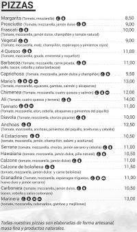

# Exercicis Mni ER - PIZZERIA ANDIAMO

Dissenyeu petits diagrames ER per cada exercici. En els subapartats de cada exercici intenta de reutilitzar els elements de diagrames anteriors.


## Ex 1.0 - Pizzes i ingredients d'una pizza

Dissenyeu un petit diagrama ER pel següent fragment del sistema: La cadena de pizzeries "Sabor & Paladar" té una carta de pizzes a on cadascuna d'elles té un nom i on cada pizza conté diferents ingredients.



## Ex 1.1 - Tamany i preu de les pizzes

Dissenyeu un petit diagrama ER pel següent fragment del sistema: La cadena de pizzeries té una carta de pizzes a on cadascuna d'elles té un nom i poden ser de diferents mides (individual, mitjana o familiar). Hem de poder guardar un preu diferent depenent de la mida i el nom de la pizza

## Ex 1.2 - Ingredients substituïbles

Dissenyeu un petit diagrama ER pel següent fragment del sistema: Cada ingredient d'una pizza pot ser substituït per altres ingredients, en cas d'inexistència. Per exemple quan no hi ha mozzarella aquesta es substitueix per formatge emmental o parmesà. O per exemple quan no hi hagi pomodoro podrem utilitzar marinara o tomàquet triturat.

## Ex 2 - Locals de la cadena de pizzeries

Dissenyeu un petit diagrama ER pel següent fragment del sistema: La cadena de pizzeries té diferents locals repartits per tot Catalunya. Els locals que poden ser de tipus restaurant, on els clients poden degustar-hi les pizzes in situ, o de tipus “per emportar”. Un mateix local pot ser, a la vegada, restaurant i admetre comandes per emportar.
Cada local l'identifiquem mitjançant un número correlatiu i ens n'hem de guardar la seva adreça completa (carrer, número, codi postal i població), la data de la seva inauguració i els metres quadrats.

## Ex 3 - Comandes de pizzes

Dissenyeu un petit diagrama ER pel següent fragment del sistema: Per cada comanda, en una pizzeria, cal enregistrar les línies que la componen, Les comandes han de guardar la següent informació d'exemple.

<sub>Nota: Revisar aquest exercici quan s'expliqui ERE</sub>

Exemple de comanda:
```
    COMANDA 278 – 25/05/2021
        2 Pizza margarita individual 10 €/unitat
        1 Pizza americana individual 12 €/unitat
        4 Aigues 1,5 €/unitat
    TOTAL: 38 €
```

## Ex 4 - Empleat del mes

Dissenyeu un petit diagrama ER pel següent fragment del sistema: Cal enregistrar a la nostra base de dades, quin empleat serveix cada comanda, en una pizzeria, per tal de poder obtenir a posteriori l’empleat del mes (aquell que ha facturat més). Els empleats els identificarem per el seu DNI, però en voldre guardar també el seu nom i cognoms.

## Ex 5 – Motoristes

Dissenyeu un petit diagrama ER pel següent fragment del sistema: A la cadena de pizzeries, cada empleat té associada una moto per si algun dia ha de fer la feina de motorista, però una moto és compartida per diversos empleats de diversos torns.

## Ex 6.0 - Empleats d'una pizzeria

Dissenyeu un petit diagrama ER pel següent fragment del sistema: La cadena de pizzeries té diferents empleats i aquests estan assignats en els diferents locals que la cadena de pizzes té arreu de tot Catalunya. Quan la cadena contracta a un empleat li assigna un perfil (cuiner, cambrer, telefonista o motorista) i un local.

Cal tenir en compte que un empleat pot canviar de rol en un dia determinat o de local. Ens interessa saber el dia que aquest empleat a començat a treballar d'aquest rol. En definitiva ens interessa guardar quins diferents rols han anat tenint els empleats i en quins locals han estat assignats.

Per simplificar el disseny un empleat no pot assignar-se dues vegades al mateix rol i local.

Per exemple:
* El dia **21/05/2000** l'empleat amb DNI **111** va entrar a treballar de **cambrer**  al **local 1** 
* El **dia 22/10/2001** el mateix empleat va canviar a **telefonista**, però sense canviar de local. 
* El dia **21/05/2000** l'empleat amb DNI **222** va entrar a treballar de **cuiner**  al **local 2**
* El dia **01/12/2002** l'empleat **222** el van canviar de local. 

## Ex 6.1 - Historial de rols i locals dels empleats

Modifica el diagrama anterior de tal manera que podem guardar l'historial que ha tingut un empleat i amb quins rols dins de la nostra cadena de pizzeries.

## Ex 7 - Estoc d'ingredients

Dissenyeu un petit diagrama ER pel següent fragment del sistema: En cada local de la cadena de pizzeries cal controlar l'estoc de cada ingredient que hi ha en un moment determinat, així com l'estoc mínim admissible. Aquest serveix perquè el sistema doni un avís de compra si l'estoc d'aquest ingredient està per sota d'aquest mínim.

## Ex 8 - Substitucions

Dissenyeu un petit diagrama ER pel següent fragment del sistema: Un empleat en un cert moment pot substituir a un altre empleat si aquest està malalt. Ens interessa saber quan el va substituir

## Ex 9 - Taules dels locals restaurant

Dissenyeu un petit diagrama ER pel següent fragment del sistema: Dissenyeu un petit diagrama ER pel següent fragment del sistema: En els locals que són de tipus restaurant, hi ha diverses taules. De cada taula ens cal saber el nombre de seients que té. Sabem que les taules s'enumeren amb un número seqüencial dins d'un local.

## Ex 10 – Reserves

Dissenyeu un petit diagrama ER pel següent fragment del sistema: En els locals de tipus restaurant s’admeten reserves. Llavors caldrà enregistrar el nom, el telèfon, el nombre de persones i la data i hora de la reserva, a més de la taula que se’ls assignarà, en el moment de fer la reserva.

Cada reserva està identificada per un codi que vindrà generat per el nostre aplicatiu.