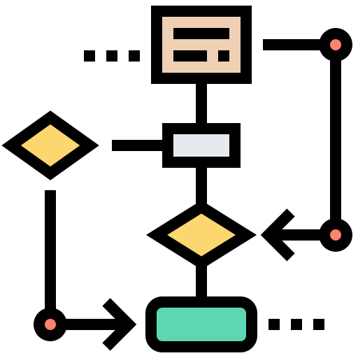

# 0: Introducció  a les Bases de Dades

## [1. NF1 Introducció a les bases de dades](<NF1 - Introducció a les bases de dades/README.md>)

En aquest apartat veurem conceptes fonamentals del món de les bases de dades, passarem per la història per saber d'on venim a on som ara. També veurem o hem de ser capaços de diferenciar el món real del el món conceptual o de les representacions.
Veurem quina a de ser l'estructura que hauria de tenir un Sistema Gestor de Base de dades (DBMS)

## [2. NF2 Disseny conceptual - model ER/ERE](<NF2 - Disseny conceptual - model ER/README.md>)

En aquest apartat treballarem el món de les representacions utilitzant el model Entitat Relació (ER) i el model Entitat Relació Estés (ERE). En veurem la simbologia, nomenclatura així com exercicis per practicar i dominar aquest tipus de diagrames.

## [3. NF3 Disseny lògic - model relacional](<NF3 - Disseny lògic - model relacional/README.md>)

En aquest apartat es veurà de forma formal, però molt sintetitzada, el model relacional creat per en Frank Codd. Ens centrarem a la part més informal i no tan acadèmica. Veurem quins són els passos per transformar un model ER/ERE en un model relacional i finalment es veurà el concepte de Normalització.

## Biblografia i Webgrafia
* [Introduction to Database Systems - Universitat de Bolzano](http://www.inf.unibz.it/~nutt/Teaching/IDBs1011/idbs-slides.html)