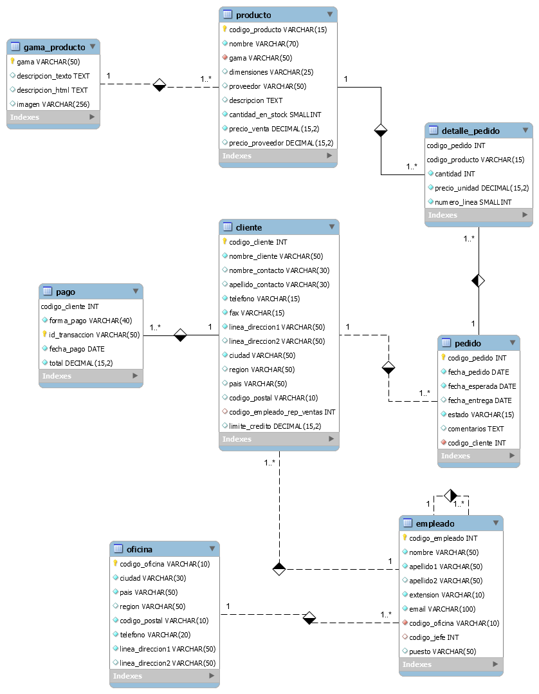

# Base de dades - Jardineria

Aquest document descriu la base de dades que simula una empresa de Jardineria a on hi ha la representació d'un model de dades a on hi ha empleats, comandes, clients, productes, etc... El nom de les taules i camps estan en castellà.

Aquesta base de dades va ser creada per a usos didàctics en assignatures com gestió de base de dades, administració de base de dades.

* [jardineria_schema.sql](jardineria_schema.sql): fitxer SQL que conté la creació de l'estructura de la BD
* [jardineria_data.sql](jardineria_data.sql): fitxer SQL que conté les dades de la BD
* diagrama_relacional.png: És l'esquema relacional de la BDmitjançant l'eina Workbench

## Model de la base de dades

