# A05 – Consultes d'agregat de dades i subconsultes.

## Descripció de l'activitat

- Treballarem amb PostGreSQL i base de dades **HR** i **PAGILA**. 
- Pots consultar els esquemes de la Base de Dades en el següent link: [Esquemes de Base de dades per PostgreSQL](https://github.com/sapa-basededades/M02-M10-Bases-de-Dades/tree/main/1%20-%20Llenguatge%20SQL%20DML%20i%20DDL/DATABASES/POSTGRESQL)
- Pots consultar el model relacional en el següent link:
  - [Pagila](https://github.com/sapa-basededades/M02-M10-Bases-de-Dades/blob/main/1%20-%20Llenguatge%20SQL%20DML%20i%20DDL/1%20-%20DATABASES/ESQUEMES/1%20-%20POSTGRES/08%20-%20Pagila/pagila-erm.png)
  - [HR]()

- Format d'entrega en pdf.
- No adjunteu captures de pantalla ni de la consulta ni amb els resultats.
- Les imatges son orientatives
- Només vull la sentencia SQL escrita (així en cas de dubte la puc copiar-enganxar i executar-la)

## Resultats d'aprenentatge

RA1. Consulta i modifica la informació emmagatzemada en una base de dades emprant assistents, eines gràfiques i el llenguatge de manipulació de dades.
- 1.a. Identifica les funcions, la sintaxi i les ordres bàsiques del llenguatge SQL (llenguatge d’interrogació estructurat) per consultar i modificar les dades de la base de dades de manera interactiva.
- 1.b. Empra assistents, eines gràfiques i el llenguatge de manipulació de dades sobre un SGBDR corporatiu de manera interactiva i tenint en compte les regles sintàctiques.
- 1.c. Realitza consultes simples de selecció sobre una taula (amb restricció i ordenació) per consultar les dades d’una base de dades.
- 1.d. Realitza consultes utilitzant funcions afegides i valors nuls
- 1.e. Realitza consultes amb diverses taules mitjançant composicions internes
- 1.f. Realitza consultes amb diverses taules mitjançant composicions externes
- 1.g. **Realitza consultes amb subconsultes**

## Tasques

### Part I – Consultes d'agregat de dades (**BDD HR**)

1. Mostra el salari més alt, el més baix, la suma i la mitjana per tots els empleats. Anomena les columnes com a "Salari maxim", "Salari minim", Suma i Mitjana respectivament. Arrodoneix els resultats a l'enter més pròxim. (0,5 punts)

   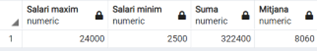
(1 fila)

2. Mostra la mitjana dels salaris i el número d'empleats que tenim. Arrodoneix la mitjana al número enter més pròxim i anomena les columnes com a "Salari mig" i "Num. Empleats" respectivament. (0,5 punts)

   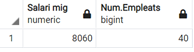
(1 fila)

3. Per cada diferent treball (JOB\_ID), calcula la mitjana dels salaris. Mostra el nom del treball (JOB\_TITLE) i ordena la informació per aquesta mateixacolumna. (1 punt)

   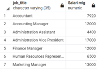

(19 files)

4. Fes una consulta per calcular la diferència que hi ha entre el salari major i el menor dels empleats (tots). Anomena la columna com a Diferencia. (0,5 punts)

   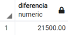

(1 fila)

5. Mostra, per cada departament, el codi del departament i el salari de l'empleat pitjor pagat en aquest departament. Exclou els empleats que no tinguin assignat departament i els departaments on l'empleat pitjor pagat cobri menys de 6000 € (1 punt)

   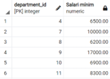

(6 files)

 **BDD PAGILA**

6. Quants clients te assignats cada encarregat (staff)? Ordena la informació per número de clients. (1 punts)

   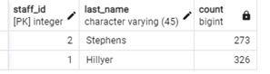

(2 files)

7. Obté el número de lloguers realitzats cada mes. El mes ha de sortir amb el següent format: mm/yyyy (ex: 05/2005). Ordena la informació per mes/any. Haureu d'agafar el camp rental\_period que es un interval. Per agafar el primer valor del interval, la data en que va ser llogada, podeu fer servir la funció lower(rental\_period)(1 punt)

   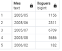

(5 files)

8. Quants actors diferents (ACTOR\_ID) de la taula FILM\_ACTOR tenim? Anomena la columna com a "Num d'actors". (0,5 punts)

   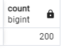

(1 fila)

9. Escriu una consulta per mostrar el nom de cada client, la ciutat on viu el client, el número de lloguers i el cost mig per tots els lloguers del client. Anomena les columnes com Nom, Ciutat, Num\_Lloguers i Cost\_Mig respectivament. Arrodoneix el cost mig a dos decimals. Ordena la informació per ciutat i nom de client. (2 punts)

   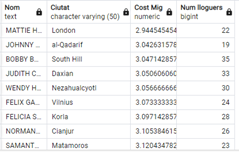
(599 files)

10. Volem saber les pel·lícules que s'han llogat més de 30 vegades. Volem saber el títol de la pel·lícula, l'any de llançament, el cost de reposició (replacement\_cost) expressat en un valor entre 0 i 1 amb un decimal (els possibles null s'han de mostrar com a 0), i el número de vegades que s'ha llogat. Ordena la informació per número de vegades que s'ha llogat de major a menor. (2 punts)

   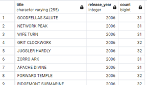

(16 registres)

## Part II – Subconsultes 

**BDD HR**

11. Obtenir el codi d'empleat, nom i salari dels empleats **que tenen el mateix salari que l'empleat 104.** (0,5 punts)

   

(2 files)

12. Obtenir el codi d'empleat, nom i salari dels empleats **que tenen el mateix salari que l'empleat 104.** Exclou l'empleat 104 del llistat. (0,5 punts)

   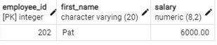

(1 fila)

13. Obté el codi empleat, nom i salari dels empleats **que guanyen més que la mitjana del salari dels empleats**. Ordena la informació per salari. (1 punt)

   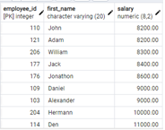

(17 files)

14. Tinc empleats del departament 9 que van ser contractat abans **QUE TOTS** elsempleat del departament 6? Mostra els cognoms i la data de contractació. (1 punt)

(2 files)

**BDD PAGILA**

  

15. Obtenir l'identificador de pel·lícula, el títol i la durada del lloguer, de les pel·lícules que tenen el preu de lloguer més alt. (1 punt)

(336 files)

16. Volem saber les pel·lícules (títol i nom de la categoria) de la categoria _Drama_ que tenen un cost de substitució (replacement\_cost) menor que alguna de les pel·lícules de la categoria "_Classics"_. (Utilitza l'operador ANY) (1 punt)

(38 files)

17. Volem saber les pel·lícules (títol i nom de la categoria) de la categoria _Drama_ que tenen un cost de substitució menor que TOTES les pel·lícules de la categoria "_Classics"_. (Utilitza l'operador ALL) (1 punt)

(2 files)

18. Intenta respondre a la mateixa pregunta que l'apartat anterior però sense utilitzar l'operador ALL. Planteja-la com vulguis. (1punts)

19. Volem saber id d'actor i nom complert dels actors que han treballat en alguna pel·lícula de les que tenen un cost de reposició (replacement\_cost) de 9.99€. (Utilitza l'operador IN) (1 punts)

(135 files)

20. Quines còpies no s'han llogat? Mostra el codi de còpia i el títol de la pel·lícula. Utilitza l'operador NOT IN. (2 punts)

(1 fila)

**Ampliació. Aquesta és de nivell a veure qui la treu! (Amb el vist fins i una mica d'imaginació es pot fer). (2 punts extra )**

21. Volem saber el número total de lloguers que es van fer en cada un dels trimestres de 2005 i el total de pel·lícules llogades en aquest any. Cal mostrar la informació tal com s'indica en la figura.

   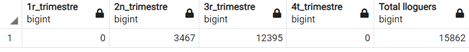

