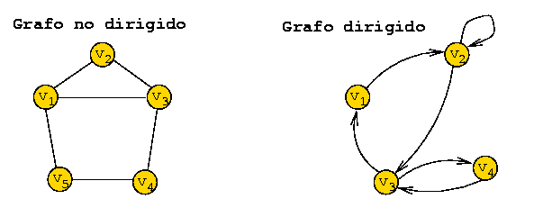
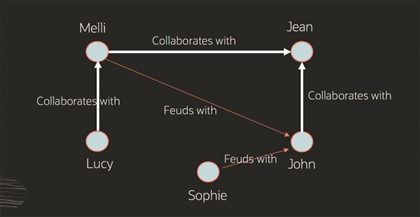
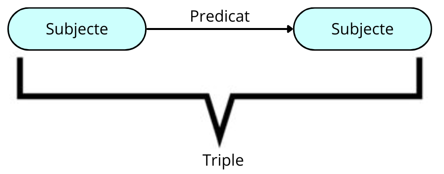

> **_NOTE:_** 
Aquest treball de recerca de les funcionalitats de Neo4J ha estat realitzat pels alumnes de 1r ASIX 23-24 (Maria del Mar Manzano, Anderson Pérez, Isaac Ruiz)

# Introducció
Neo4j és una base de dades orientada a gràfs de codi obert implementada en Java, reconeguda pel seu alt rendiment. Els seus desenvolupadors la descriuen com un magatzem de gràfs transaccional compatible amb ACID amb emmagatzematge i processament de gràfs natius. Implementat en Java, Neo4j és accessible des de programari escrit en diversos llenguatges utilitzant el llenguatge de consulta Cypher. Aquest llenguatge declaratiu, inspirat en SQL, permet consultar, crear, inserir, modificar i eliminar dades en Neo4j.

# Bases de dades orientades a grafs

Aquestes bases de dades representen la informació mitjançant nodes d'un graf i les seves relacions amb les arestes del mateix. Això permet utilitzar la teoria dels grafs per recórrer la base de dades, ja que aquesta pot descriure els atributs dels nodes (entitats) i les arestes (relacions) entre ells. Per comprendre les bases de dades orientades a gràfs, primer s'ha de tenir clar què és un graf.

## 1. Què és un graf?

La paraula "graf" prové del grec, que pot ser traduït com a "imatge" o "dibuix". Existeixen diversos tipus de grafs que podem utilitzar en projectes digitals, i les seves característiques ofereixen moltes possibilitats en l'anàlisi i la resolució de problemes de dades a nivell empresarial.

Un graf es defineix com una col·lecció de nodes que es relacionen entre ells mitjançant un conjunt de connexions anomenades arestes. Els nodes contenen informació rellevant, mentre que les arestes representen les relacions entre els nodes. Aquests grafs són extremadament útils en situacions complexes, cosa que explica per què és comú trobar la implementació d'anàlisi de grafs en estudis de ciències exactes, ciències socials i en aplicacions informàtiques com la que estem tractant.

### 1.2. Tipus de grafs
#### **1.2.1. Graf dirigit**

Un graf dirigit, com és conegut, està compost per un conjunt de vèrtexs i arestes on cada aresta està associada de forma unidireccional amb una altra mitjançant una fletxa. Les arestes, segons si es dirigeixen cap a dins o cap a fora d'un node, reben el nom de "aresta entrant" o "aresta sortint". La característica comuna és que sempre tenen una destinació definida cap a un node.

#### **1.2.2. Graf no dirigit**

Els grafs no dirigits són aquells que es componen d'un conjunt de vèrtexs connectats per un conjunt d'arestes de manera no direccional. Això vol dir que una aresta pot ser recorreguda des de qualsevol dels seus punts en qualsevol direcció sense distinció.

### 1.3. Propietats principals dels grafs
Els grafs són una entitat rica en característiques i dinàmiques operatives que enriqueixen la seva utilitat.

Una de les principals propietats dels grafs és l'**adjacència**, que es refereix a la relació entre dues arestes que comparteixen una connexió o relació amb un vèrtex comú. Aquesta relació entre arestes és clau per entendre les interconnexions dins del graf.

Una altra característica important és la **incidència**, que simplement indica quan un vèrtex està connectat a un altre. Aquesta propietat és fonamental per comprendre la estructura de connexions d'un graf.

Cal també tenir en compte la **ponderació** dels grafs, que implica assignar a cada aresta una valoració o pes específic, per tal d'augmentar la seva expressivitat i utilitat en estudis d'optimització i altres àrees.

Finalment, tenim la propietat d'**etiquetat**, que consisteix en distingir els vèrtexs mitjançant una marca o etiqueta que els fa diferenciables entre ells. Aquesta característica és útil per identificar i categoritzar els vèrtexs del graf de manera clara i precisa.

## 2. Bases de dades orientades a grafs

### 2.1. Què és?

Una base de dades orientada a gràfs és una plataforma especialitzada amb un únic propòsit: crear i manipular gràfs. Els gràfs contenen nodes, arestes i propietats que s'utilitzen per representar i emmagatzemar dades d'una manera que les bases de dades relacionals no permeten.

L'analítica de gràfs és un altre terme comú que fa referència específicament al procés d'analitzar dades en un format de gràfics, utilitzant els punts de dades com a nodes i les relacions com a arestes. Per a realitzar l'analítica de gràfics, es requereix una base de dades que admeti el format de gràfics, com ara una base de dades orientada a gràfics especialitzada o una base de dades convergent que admeti diferents models de dades, incloent els gràfics.

### 2.2. Tipus de bases de dades orientades a grafs

Hi ha dos models comuns de bases de dades orientades a grafs: **grafs de propietats** i **grafs RDF**. Els grafs de propietats es centren en l’anàlisi i les consultes, i els RDF es centren en la integració de dades. Ambdós tipus de grafs consisteixen en un conjunt de punts (vèrtexs) i de les connexions entre aquest dos punts (vores) però tenen diferències.

#### **2.2.1. Grafs de propietats**

Els grafs de propietats són utilitzats per modelar les relacions entre les dades i permeten realitzar anàlisi i consultes sobre les dades en funció d'aquestes relacions. En un graf de propietats, els nodes (o vèrtexs) poden contenir informació detallada sobre un tema específic, i les arestes (o vores) serveixen per destacar les relacions entre aquests nodes. Tant els nodes com les arestes poden tenir atributs, coneguts com a propietats, associats a ells. Aquestes propietats proporcionen informació addicional sobre els nodes o les arestes, el que permet una representació més rica i detallada de les relacions entre les dades en el graf.

#### **2.2.2. Grafs RDF**

Els grafs **RDF** (Resource Description Framework) compleixen amb un conjunt d'estàndards establerts pel W3C (World Wide Web Consortium) dissenyats per representar declaracions. Són considerats la millor opció per representar metadades complexes i dades principals, i són amplament utilitzats per a dades vinculades, integració de dades i grafs de coneixement.

En el model RDF, una sentència està representada per quatre elements essencials: una aresta anomenada "triple", el node origen, conegut com a "subjecte", l'aresta que connecta ambdós nodes, anomenada "predicat", i el node de destinació, anomenat "objecte". És important notar que en un graf, un node pot actuar com a subjecte en un triple i com a objecte en un altre, permetent així la representació de diverses relacions i connexions entre els nodes en el graf RDF.

El model RDF proporciona un mètode estandarditzat i amb una semàntica ben definida per publicar dades, facilitant així l'intercanvi d'informació de manera eficient i precisa. Aquesta capacitat de publicar dades amb un format estandarditzat és molt valuosa per a diverses entitats i organitzacions.

Entitats com les agències estatals d'estadístiques, les empreses farmacèutiques i les organitzacions sanitàries, entre d'altres, fan un ús generalitzat dels grafs RDF. Aquestes organitzacions utilitzen els grafs RDF per gestionar i compartir dades, ja que ofereixen una manera estructurada i semàntica de representar la informació, facilitant la interoperabilitat i l'intercanvi de dades entre diferents sistemes i plataformes.

# Història

## 1. Bases de dades de grafs

La base de dades de grafs s'ha considerat tradicionalment com un subtipus de bases de dades NoSQL, en contraposició amb les bases de dades centrades en SQL, conegudes com a bases de dades relacionals, que han dominat el panorama de bases de dades des de finals de la dècada de 1980 i encara són àmpliament utilitzades en entorns empresarials, ja siguin grans o petits.

El seu concepte bàsic es basa en la teoria de grafs, coneguda pel problema dels set ponts de Königsberg publicat pel matemàtic Leonhard Euler entre 1735 i 1736. Tot i així, les bases de dades de grafs no van començar a prendre forma fins als darrers 10 anys, gairebé 40 anys després de la invenció d'Internet i el naixement de la computació moderna.

Les bases de dades de grafs han evolucionat al llarg de diverses dècades, amb els primers models de bases de dades que admetien estructures semblants a arbres a mitjans dels anys seixanta. A finals de la dècada de 1960, es van desenvolupar bases de dades de grafs, i el model de dades lògics va introduir els grafs etiquetats a mitjans dels anys vuitanta.

A principis dels anys noranta, van sorgir les bases de dades d'objectes comercials (ODBMS), i les millores en les bases de dades de grafs van continuar fins a finals de la dècada de 1990 amb la indexació de pàgines web. Durant aquest temps, van sorgir diverses propostes per als estàndards de dades web del W3C com XML i RDF, els quals són en realitat models de dades de grafs a la seva base. El Object Data Management Group va publicar un llenguatge estàndard per definir estructures d'objectes i relacions l'any 2000. En aquest mateix any, es va fundar Neo technologies i va començar a desenvolupar la seva base de dades de grafs, Neo4j, juntament amb el llenguatge de consulta declaratiu per al model de grafs, Cypher. Aquest llenguatge va prendre alguns conceptes com la concordança de patró de gràfics de SPARQL.

Les bases de dades de grafs comercials amb garanties ACID, com Neo4j i Oracle Spatial and Graph, van estar disponibles a mitjans i finals dels anys 2000. Durant la dècada de 2010, es van desenvolupar bases de dades amb capacitat d'escalabilitat horitzontal i multimodel que admetien models de grafs, així com bases de dades de grafs basades en el núvol com Amazon Neptune i Neo4j AuraDB.

Les bases de dades de grafs han crescut en popularitat en els darrers anys, ja que ofereixen una manera eficaç de gestionar i consultar relacions de dades complexes. Representar relacions complexes entre dades en bases de dades tradicionals pot ser un repte, mentre que les bases de dades de grafs representen les dades com una xarxa de nodes i arestes, facilitant la modelització de relacions intricades entre dades.

S'han inventat molts algorismes de gràfics al llarg del temps, des del famós algorisme de Dijkstra (1956) per a la resolució del problema del camí més curt en un graf fins al PageRank, inventat per un cofundador de Google a finals dels anys noranta, i la modularitat de Louvain, utilitzada per a la detecció de comunitats en un graf.

## 2. NEO4J
La primera versió de Neo4j va ser llançada per Neo Technology a San Francisco al febrer de 2010, i es tracta d'un projecte en curs, amb la seva última versió estable, la 3.0, publicada a l'abril de 2016. La idea principal darrere del desenvolupament de Neo4j com a software de processament de grafs era emmagatzemar les relacions com a entitats de primera classe, a diferència de les bases de dades NoSQL agregades.

Neo4j va ser creat inicialment com una base de dades Java incrustada, d'aquí ve el "4j" en el nom. Tot i que ha evolucionat més enllà d'aquesta implementació inicial, l'aspecte de Java ja no és rellevant avui en dia, però és un record de la seva història.

El projecte de Neo4j va sorgir per abordar problemes que els fundadors van trobar en la construcció d'un sistema de gestió de continguts (CMS), especialment en el tractament dels drets i les metadades de les fotografies. Va ser difícil representar tota la complexitat de les connexions i relacions en una base de dades relacional, i això va impulsar la creació de Neo4j.

Ràpidament, els fundadors van adonar-se que hi havia molts altres casos d'ús interessants per a Neo4j, més enllà de l'aplicació original del CMS. Va ser adoptat ràpidament per generar recomanacions personalitzades, gestionar logística i encaminament, així com abordar patrons d'accés complexos en àmbits com la gestió d'identitat i accés, la detecció de frau i sistemes de xarxa de pagament.

Aquests casos d'ús van mostrar com Neo4j era capaç de comprendre les connexions de les dades i per què aquestes connexions eren crucials per als usuaris, sent aquests els fonaments del seu èxit inicial.

# Casos d’utilització
Neo4j és una base de dades altament flexible i escalable que troba aplicació en una ampla varietat de casos d'ús en diferents industries. Alguns dels casos més comuns de Neo4j inclouen:

## Anàlisi de xarxes socials
En aquest escenari, Neo4j s'utilitza per modelar i analitzar xarxes socials, on els nodes representen entitats com persones o comptes, i les relacions entre elles poden representar diverses connexions socials com amistat, seguir, etiquetar, etc. Mitjançant Neo4j, es poden descobrir patrons de comportament, influenciadors clau, comunitats i relacions d'influència en una xarxa social. Aquesta anàlisi és útil per a campanyes de marketing, anàlisi d'opinions i detecció de comportament anòmal.

## Gestió d'identitats i accessos
En aquest escenari, Neo4j s'utilitza per a la modelització i gestió d'identitats, així com per al control d'accés a recursos en sistemes de seguretat i autenticació. Mitjançant Neo4j, es pot administrar eficaçment els rols i els permisos d'usuari, a més de detectar i prevenir l'accés no autoritzat mitjançant l'anàlisi de les relacions entre les entitats i els recursos.

## Recomanacions personalitzades
Neo4j s'utilitza per crear models de perfils d'usuari i establir relacions entre entitats com productes, serveis o contingut. Aquesta capacitat permet desenvolupar sistemes de recomanació personalitzats que poden suggerir productes rellevants, pel·lícules, música o connexions socials basades en les preferències i comportaments de l'usuari. Aquest enfocament millora l'experiència de l'usuari i promou una major participació en la plataforma.

## Gestió de coneixement i grafs d'ontologia
Neo4j es fa servir en aquest context per modelar i analitzar les relacions entre conceptes en dominis complexes com la ciència, la medicina, la biotecnologia i l'enginyeria. Aquesta utilització permet representar i analitzar el coneixement de manera més eficient, descobrir noves relacions i patrons, i facilitar la inferència i el raonament en sistemes d'intel·ligència artificial i presa de decisions.

## Detecció de frau i anàlisi forense
Neo4j s'utilitza per analitzar extenses bases de dades financeres i transaccionals, en busca de patrons de frau i relacions sospitoses entre entitats com comptes, transaccions i comportaments. Aquesta utilització ajuda a detectar activitats fraudulentes o criminals, prevenir pèrdues i millorar la seguretat financera i operativa.

## Gestió de la cadena de subministrament i logística
Neo4j és utilitzat per modelar i analitzar la complexa xarxa de relacions entre proveïdors, productes, ubicacions i processos a la cadena de subministrament i logística. Aquesta capacitat permet optimitzar l'eficiència i la visibilitat d'extrem a extrem, identificar punts febles, predir la demanda i millorar la presa de decisions a la cadena de subministrament.

## Cerca i anàlisi de dades en línia
Neo4j s'utilitza per a la construcció de motors de cerca i sistemes d'anàlisi de dades en línia que poden descobrir i visualitzar connexions i patrons en grans conjunts de dades, incloent dades web, dades de l'Internet de les Coses (IoT) i dades de sensors. Aquesta funcionalitat permet realitzar cerques més intel·ligents, descobrir informació rellevant i prendre decisions informades en temps real.

## Gestió de contingut i recomanació de contingut
Neo4j es fa servir per modelar i gestionar les relacions entre contingut digital, com ara articles, vídeos, música i productes. Aquesta funcionalitat facilita la personalització i la recomanació de contingut rellevant als usuaris en funció dels seus interessos i comportaments. Això no només millora l'experiència de l'usuari, sinó que també augmenta la participació i la retenció dels usuaris a la plataforma.

# Versions
Neo4j té dues versions autogestionades per escollir **Community Edition (CE)** i l'**Enterprise Edition (EE)**. La versió Enterprise inclou totes les opcions que ofereix la versió Community però afegint algunes qüestions com ara còpies de seguretat, clúster i capacitats de commutació per error.
- **Community Edition**: es tracta d'una versió completa de Neo4j, apta per a desplegaments en una sola instància. Inclou totes les característiques principals de Neo4j, com ara transaccions compatibles amb ACID, Cypher i API de programació. És ideal per a l'aprenentatge de Neo4j, projectes casolans i aplicacions en petits grups de treball.
- **Enterprise Edition**: aprofundeix en la funcionalitat de la versió Community al incorporar característiques clau per millorar el rendiment i l'escalabilitat. Això inclou una arquitectura de clúster i funcionalitats de còpia de seguretat en línia. A més, s'afegeixen funcions de seguretat addicionals, com ara control d'accés basat en rols i suport per LDAP, com el directori actiu (Active Directory). Aquesta opció està destinada a sistemes de producció amb exigències d'escalabilitat i disponibilitat, com ara solucions internes crítiques i comercials.

# Comparacions
Existeixen diferents bases de dades orientades a grafs en el mercat actual. Cadascuna té un conjunt important de propietats que les fan considerar per els nostres projectes.
La seva gran majoria té els beneficis claus de les bases de dades de grafs en el que es refereix a la seva capacitat d'escalabilitat i rendiment.
## Avantatges i desventatges de les Bases de Dades orientades a Grafs
### Avantatges 
Les bases de dades orientades a grafs tenen diversos avantatges respecte a les bases de dades convencionals:
#### **Flexibilitat**
Gràcies a la seva alta flexibilitat, les bases de dades de grafs poden adaptar-se fàcilment a nous models de dades i esquemes. Això facilita l'afegiment o canvi de dades sense necessitat de realitzar ajustaments significatius en l'esquema de la base de dades, una avantatge enfront de les bases de dades relacionals, on aquest procés sovint suposa un inconvenient.
#### **Rendiment**
Les bases de dades de grafs són òptimes per a l'execució de consultes complexes en grans conjunts de dades, ja que estan especialment dissenyades per recórrer eficientment les relacions entre nodes i arestes. Aquesta funció és freqüent en moltes aplicacions, i les bases de dades de grafs estan optimitzades específicament per a aquest propòsit.
#### **Escalabilitat**
Les bases de dades de grafs freqüentment tenen la capacitat d'escalar horitzontalment, permetent afegir més nodes al clúster per augmentar tant l'emmagatzematge com la capacitat de processament. Aquesta característica pot simplificar la gestió de grans quantitats de dades i el maneig de múltiples consultes simultànies. En altres escenaris, els grafs poden ser emmagatzemats en una clau on es poden escalar mitjançant l'afegiment de rèpliques.
#### **Processament del llenguatge natural**
Les bases de dades de grafs són altament apropiades per a la ciència de dades i l'aprenentatge automàtic quan es combinen amb aplicacions de processament del llenguatge natural (NLP), com ara chatbots, assistents virtuals i anàlisi de sentiments. Són utilitzades amb facilitat per modelar les relacions entre paraules i frases.
#### **Integració de dades**
L'ús de bases de dades de grafs permet la combinació de dades estructurades i no estructurades provinents de diverses fonts. Aquesta capacitat pot simplificar la tasca d'obtenir conclusions a partir de múltiples fonts de dades.
### Desavantatges
#### **Estandardització**
En l'actualitat, les bases de dades de grafs no disposen d'un llenguatge de consulta estandarditzat. No obstant això, existeixen diversos llenguatges de modelatge de dades de grafs estàndards en el sector, com ara RDF (Resource Description Framework) i OWL (Web Ontology Language), així com Cipher. A més, diverses iniciatives estan en marxa per crear llenguatges de consulta estandarditzats per a bases de dades de grafs, com ara GQL (Graph Query Language) i SPARQL (SPARQL Protocol and RDF Query Language).

A causa d'això, el canvi entre diferents bases de dades de grafs o la integració de bases de dades de grafs amb altres tecnologies pot representar un repte a causa de la manca d'estandardització en les consultes. Cada proveïdor de bases de dades de grafs sol tenir el seu propi llenguatge de consulta i sintaxi, fet que dificulta la migració de dades o la integració amb altres sistemes.
#### **Comunitats limitades de desenvolupadors i usuaris**
 Les bases de dades de grafs compten amb una comunitat de desenvolupadors i usuaris més reduïda en comparació amb les tecnologies de bases de dades més consolidades, com ara les bases de dades relacionals. A consequència d'això, trobar recursos, informació i suport mentre es treballa amb bases de dades de grafs pot ser més desafiador. Tot i així, és rellevant assenyalar que la comunitat entorn de les bases de dades de grafs està creixent de manera significativa.
#### **Coherència de dades**
Les bases de dades de grafs són concebudes per permetre una relació més flexible i dinàmica entre les dades, la qual cosa pot dificultar l'aplicació de regles estrictes de coherència de dades. Tot i això, és important destacar que moltes bases de dades de grafs proporcionen mecanismes per assegurar la coherència de les dades, com ara l'ús de restriccions o regles de validació. A més, la coherència de les dades també pot ser implementada a nivell d'aplicació, en comptes de dependre exclusivament de la tecnologia de la base de dades.

## Comparació de Neo4j amb altres sistemes gestors de Bases de Dades
### Neo4j
#### Avantatges
- Amb la seva pròpia investigació, aquest motor garanteix la velocitat i emmagatzema gràfics natius.
- La garantia de les propietats ACID fa que les operacions de Neo4j siguin extremadament fiables.
- Ofereix un rendiment excel·lent en aplicacions de gràfics que permeten una comprensió en profunditat de les relacions entre les dades contingudes en el gràfic, juntament amb un suport de clúster de temps d'execució i failover altament efectiu.
#### Desavantatges
- Utilitza un llenguatge de consulta particular que difereix notablement de SQL, per tant, implica una fase inicial d'aprenentatge que pot suposar un esforç addicional en el maneig d'aquesta eina.
### Amazon Neptune
#### Avantatges
- Es tracta d'una base de dades gestionada de forma completa, la qual, a més, admet llenguatges de consulta de codi obert com Gremlin o SPARQL, els quals estan totalment estandarditzats i no suposen cap dificultat addicional.
- Aquesta base de dades ofereix capacitat d'emmagatzematge escalable fins a 64TB, distribuïda en sis rèpliques amb tres zones d'alta disponibilitat.
#### Desavantatges
- Aquesta plataforma de base de dades no suporta anàlisis de PageRank.
- Les seves emmagatzematges de dades de Gremlin i SPARQL no estan interconnectats, generant així un desafiament operatiu.
- Les consultes de grafs estan restringides a només tres nivells de profunditat, la qual cosa limita significativament les seves capacitats.
### Azure Cosmos
#### Avantatges
- Ofereix un servei de bases de dades multimodel distribuït globalment, amb una distribució i partició horitzontal que possibilita una escalabilitat notable i la gestió eficient de grans volums de dades.
- Suporta quatre models de dades NoSQL i inclou cinc conjunts d'API que abasten tant llenguatge SQL com sis entorns de programació diversos.
- Es fragmenta automàticament de manera horitzontal, generant i administrant índexos, ampliacions i sincronitzacions per regions.
- Proporciona una gamma de models de consistència per satisfer les necessitats de l'aplicació al cost més eficient, i a més, és compatible amb MongoDB, Azure Tables i Apache TinkerPop.
#### Desavantatges
- Cadascuna de les API d'aquesta base de dades necessita un compte individual per a la seva aplicació.
- Exhibeix una elevada interoperabilitat amb diverses plataformes, tot i que no ofereix suport per a SQL ni cap model de dades relacional.
### Arango BD
#### Avantatges
- La principal avantatge d'ArangoDB radica en la seva flexibilitat i capacitat d'adaptació a través de diverses modalitats de treball.
- Les seves freqüents actualitzacions han impulsat el desenvolupament d'aquest motor, assegurant el compliment de les operacions ACID, una característica que no estava disponible en versions anteriors.
#### Desavantatges
- Les restriccions de la seva botiga de valors clau i algunes limitacions en la implementació d'API fan que la migració de dades des d'altres tipus de bases de dades NoSQL híbrides sigui més complexa o estigui més limitada.

[^1]: [It can take up to 10 minutes for changes to your site to publish after you push the changes to GitHub](https://docs.github.com/en/pages/setting-up-a-github-pages-site-with-jekyll/creating-a-github-pages-site-with-jekyll#creating-your-site).

[Just the Docs]: https://just-the-docs.github.io/just-the-docs/
[GitHub Pages]: https://docs.github.com/en/pages
[README]: https://github.com/just-the-docs/just-the-docs-template/blob/main/README.md
[Jekyll]: https://jekyllrb.com
[GitHub Pages / Actions workflow]: https://github.blog/changelog/2022-07-27-github-pages-custom-github-actions-workflows-beta/
[use this template]: https://github.com/just-the-docs/just-the-docs-template/generate